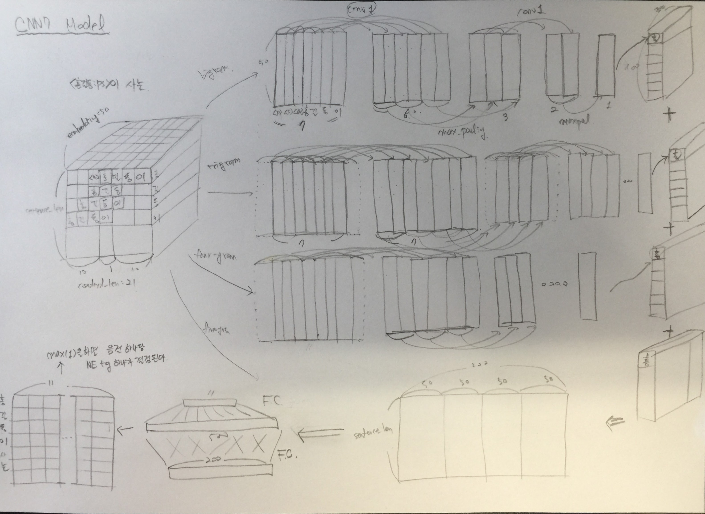
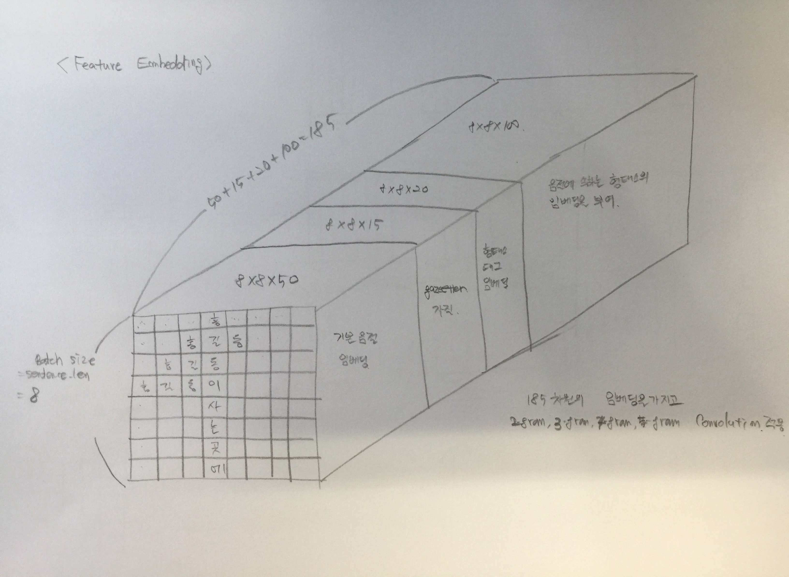

logdir
====

Version 0.1
----

* 오류가 있던 것을 모두 수정하고 최초로 제대로된 F-Score를 측정한 버전
* 하이퍼 파라미터
  - w10: window size 10
  - e50: embedding dimension 50

### fnn1.w10.e50

```
iter	loss	accuracy	f-score
1140	0.06389725208282471	0.9347197717632043	0.5480769230769231
948	0.005601470358669758	0.9342693044033185	0.5474328459707581
883	0.0011875152122229338	0.9347573107098615	0.5459590704127645
884	0.0	0.9349074664964901	0.5457054156605725
934	0.011114674620330334	0.9356957843762904	0.5455777702473736
```

### cnn1.w10.e50

```
iter	loss	accuracy	f-score
409	5.933973625360522e-06	94.98479672660385	0.6387596899224807
422	0.001057555084116757	94.97728893727242	0.6383319967923016
433	0.002902984619140625	94.9022110439581	0.6219797349961029
182	0.0025629119481891394	94.87968767596381	0.6187106918238994
184	0.03130186349153519	94.65445399602088	0.6181959564541213
```


Version 0.2
----

* vocabulary 생성 시 최소 빈도로 컷오프 적용
* 자소 => 음절 convolution을 적용
* 하이퍼 파라미터
  - cut5: vocabulary에서 cutoff 최대 빈도 5 (5를 포함 빈도 5이하는 unknown 처리)
  - chr/pho: 음절 기반 vs 자소 => 음절 convolution

### fnn1.cut5.chr.w10.e50

```
iter	loss	accuracy	f-score
888	0.11146090924739838	0.9360336348962048	0.5565097904500171
858	0.005829782225191593	0.9359585570028905	0.547505126452495
569	0.012942643836140633	0.9357708622696047	0.5474705474705475
670	0.1331184059381485	0.9349825443898044	0.5473684210526315
938	0.2120111584663391	0.9364465633094335	0.5450791465932553
```

### fnn1.cut5.pho.w10.e50

```
iter	loss	accuracy	f-score
365	0.2835409343242645	0.9029618228912497	0.3929159802306425
266	0.16550394892692566	0.9045759975975074	0.38995684582189094
192	0.186726912856102	0.9061150944104508	0.3897002305918525
181	0.8509067296981812	0.9031119786778783	0.3894523326572008
173	0.13992783427238464	0.904238147077593	0.38856701429123214
```

### cnn1.cut5.chr.w10.e50

```
iter	loss	accuracy	f-score
455	0.03936859220266342	0.9501482788392958	0.6673796791443851
463	0.01592673361301422	0.9501858177859529	0.6591943957968477
456	0.12859639525413513	0.9489094935996096	0.6545064377682404
448	2.458360540913418e-05	0.9485716430796952	0.6522195036700454
279	0.008183086290955544	0.9500356619993243	0.6516308119361555
```

### cnn1.cut5.pho.w10.e50

```
iter	loss	accuracy	f-score
207	0.45965152978897095	0.9325049739104321	0.5697896749521989
176	0.26127755641937256	0.9314538834040317	0.5615120274914089
369	0.06601954996585846	0.9332557528435752	0.5613259668508287
275	0.020682914182543755	0.9304778707909456	0.5610130468150423
242	0.011091327294707298	0.9301400202710312	0.5596432552954291
```


Version 0.3
----

* 3-gram convolution만 이용하여 CNN 모델 변경

### fnn3.cut5.chr.w10.e50

```
iter	loss	accuracy	f-score
737	0.0014323184732347727	0.9358084012162619	0.5520082389289392
553	0.030311860144138336	0.9354330117496903	0.5492763611302551
345	0.16148419678211212	0.9359585570028905	0.5475862068965517
794	0.17236889898777008	0.9373099590825481	0.5463313813296589
1043	0.20478792488574982	0.9370847254026052	0.5462126476719944
```

### fnn3.cut5.pho.w10.e50

```
iter	loss	accuracy	f-score
244	0.09925560653209686	0.9045759975975074	0.39190797302657676
132	0.018088437616825104	0.9045009197041931	0.3911696359411309
348	1.4216821193695068	0.9073163407034799	0.3881503987846563
104	0.24546019732952118	0.9043883028642217	0.38548575887631686
242	0.6337459683418274	0.9070911070235369	0.38321456848772767
```

### cnn3.cut5.chr.w10.e50

```
iter	loss	accuracy	f-score
417	1.0072451829910278	0.940876159014978	0.579172610556348
300	0.26204895973205566	0.9381358159090056	0.5783582089552238
221	0.04115565866231918	0.9384361274822628	0.5773044436283511
745	0.7646958231925964	0.9405383084950636	0.5770049680624557
230	0.12591029703617096	0.9389241337888059	0.5760869565217391
```

### cnn3.cut5.pho.w10.e50

```
iter	loss	accuracy	f-score
251	0.11104550212621689	0.9126468711287962	0.4589186888037463
148	0.5529150366783142	0.9103194564360524	0.4579153946794593
241	0.5005360841751099	0.9117834753556815	0.4505727619855749
186	0.01902482844889164	0.9114080858891099	0.4499165275459098
176	0.5272887945175171	0.9120837869289388	0.44481605351170567
```


Version 0.4
----

* gazetteer 매핑 여부를 one hot 벡터로 만들어 각 음절 뒤에 추가 (___오류 존재___)
* 50 임베딩 차원 => 50 임베딩 차원 + 15 one hot 차원
* 하이퍼 파라미터
  - gzt1/gzte: gazetteer 자질을 사용할 때 one hot으로 할 지 임베딩으로 할 지 여부

### fnn4.cut5.chr.w10.e50.gzt1

```
iter	loss	accuracy	f-score
912	0.0	0.9443297421074365	0.7160686427457097
701	0.0	0.9439543526408649	0.7123928293063133
1060	0.0	0.9440669694808363	0.7123394316854806
601	0.0	0.9442922031607793	0.712156862745098
1036	0.0	0.9439543526408649	0.7106991116261104
```

### fnn4.cut5.pho.w10.e50.gzt1

```
iter	loss	accuracy	f-score
42	0.08063111454248428	0.9367093359360337	0.6839258114374035
115	0.0006394889787770808	0.9370471864559481	0.6827217125382262
200	0.0010512167355045676	0.9370096475092909	0.6818700114025085
38	0.17023685574531555	0.9365967190960621	0.6816965991593428
28	0.006455023307353258	0.9371222643492624	0.68131021194605
```

### cnn4.cut5.chr.w10.e50.gzt1

```
iter	loss	accuracy	f-score
272	0.1546803116798401	0.9320545065505462	0.5380249716231554
94	0.15503661334514618	0.9263485866586584	0.5370726085286208
270	0.01866385154426098	0.9299523255377454	0.5325310267017676
218	0.14186353981494904	0.9254101129922294	0.5272296764009472
415	0.11918769031763077	0.926010736138744	0.5270758122743683
```

### cnn4.cut5.pho.w10.e50.gzt1

```
iter	loss	accuracy	f-score
191	0.03768694028258324	0.9116333195690529	0.4252336448598131
111	0.22703267633914948	0.901122414505049	0.4085470085470085
177	0.36615341901779175	0.9056646270505649	0.40731292517006806
216	0.055944204330444336	0.9084425091031946	0.40477169888934594
156	0.2823198735713959	0.9038252186643643	0.4040800313848568
```


Version 0.5
----

* 기존의 Conv1D 클래스를 사용한 CNN 모델로 회귀
* CNN5: 3-gram convolution만 적용해 봄 (임베딩 50차원 고정)
* CNN6: 2,3,4,5-gram 및 임베딩 200차원 고정 적용

### cnn5.cut5.chr.w10.e50.gzt1

```
iter	loss	accuracy	f-score
1025	0.013790911063551903	0.9466571568001801	0.6225490196078431
1076	0.3169684112071991	0.9430534179210931	0.6209310465523276
789	0.27251875400543213	0.9433912684410075	0.6199859254046447
786	0.0006812168867327273	0.9432411126543789	0.6199442119944211
939	0.5146646499633789	0.944217125267465	0.6196297589940621
```

### cnn5.cut5.pho.w10.e50.gzt1

```
iter	loss	accuracy	f-score
690	0.09616132080554962	0.9235707046060287	0.4904970760233918
693	0.22901096940040588	0.9215060625398851	0.4860703812316715
666	0.0693606585264206	0.9227823867262285	0.48591813743897855
650	2.250678539276123	0.9222568414730282	0.48570367619754923
745	0.290861576795578	0.9206426667667705	0.484981684981685
```

### cnn6.cut5.chr.w10.e200.gzt1

```
iter	loss	accuracy	f-score
318	0.2111687958240509	0.9501107398926386	0.6600884654644437
282	0.14333100616931915	0.9527384661586396	0.6535714285714286
277	0.02030348777770996	0.9511242914523819	0.6433416636915388
311	0.00017057146760635078	0.9504110514658959	0.6426043878273178
173	0.045086733996868134	0.9501482788392958	0.6420824295010845
```


Version 0.6
----

* gazetteer one hot 벡터 자질의 오류가 수정 됨

### cnn7.cut5.chr.w10.e200.gzt1

```
iter	loss	accuracy	f-score
129	0.012380723841488361	0.9447426705206652	0.7100727690540023
116	0.7343000173568726	0.9445925147340366	0.7078095238095238
221	0.00952844601124525	0.9448928263072938	0.7064220183486238
121	0.00848415493965149	0.9439168136942078	0.7062475746992627
107	0.07175702601671219	0.9448552873606366	0.7042036251446202
```


Version 0.7
----

* positional encoding 자질을 워드 임베딩에 더해줌
* 하이퍼 파라미터
  - pe0: positional embedding 방법 (0: 사용 안함, 1: method 1, 2: method 2, ...)

### fnn5.cut5.chr.w10.e50.gzt1.pe0

```
iter	loss	accuracy	f-score
936	0.0	0.9445174368407222	0.7143968871595331
1026	0.0	0.9441795863208078	0.7134593135364444
1075	0.0	0.9447802094673223	0.7133462282398454
928	0.0	0.9447802094673223	0.7121270825261528
938	0.0	0.9445174368407222	0.7108527131782946
```

### fnn5.cut5.chr.w10.e50.gzt1.pe1

```
iter	loss	accuracy	f-score
1130	0.039069436490535736	0.9450805210405796	0.7108201771274548
771	0.0	0.9441045084274935	0.7095036552520201
778	0.0	0.9440294305341792	0.709126213592233
1144	0.0	0.944930365253951	0.7090483619344774
1137	0.0	0.9444423589474079	0.7073455110765644
```

### cnn7.cut5.chr.w10.e50.gzt1.pe0

```
iter	loss	accuracy	f-score
145	0.003377556800842285	0.944217125267465	0.7313317936874519
118	0.038111478090286255	0.9435414242276362	0.7253169419900114
93	0.0008701409678906202	0.9443297421074365	0.7248062015503877
154	3.1441450119018555e-06	0.9435789631742934	0.7246713070378964
66	0.001496876240707934	0.9442546642141222	0.7246153846153846
```

### cnn7.cut5.chr.w10.e50.gzt1.pe1

```
iter	loss	accuracy	f-score
197	8.995468306238763e-06	0.9453432936671797	0.7324165029469548
117	0.1670588254928589	0.9455685273471226	0.7317454119484575
253	0.0007301405421458185	0.9460940726003229	0.7303326810176125
293	4.875659942626953e-05	0.945193137880551	0.7302452316076296
284	0.1991797834634781	0.944930365253951	0.7299726455646738
```


Version 0.8
----

* Learnig Rate 조절 정책
* 하이퍼 파라미터
  - ri24: revert iteration = 24. 이전 최대 f-score를 넘지 못하면 이전 최대치로 revert하고 learning rate를 10% 감소하는 반복 회수
  - rt10: revert termination = 10. 이전 최대 f-score로 revert할 최대 회수 => 최대 회수가 넘으면 종료

### fnn5.cut5.chr.w10.e50.gzt1.pe0.ri24.rt10

```
iter	loss	accuracy	f-score
973 0.0011724987998604774   0.9412451948443507  0.7161803713527851
1124    0.003362160176038742    0.9409060073867491  0.7158054711246201
772 1.2367963790893555e-06  0.9409060073867491  0.7147766323024055
1006    1.860716838564258e-05   0.9412828823396397  0.7147740220281048
746 0.0 0.9407929449008818  0.7146136189747513
```

### fnn5.cut5.chr.w10.e50.gzt1.pe1.ri24.rt10

```
iter	loss	accuracy	f-score
254 0.006689889822155237    0.9410944448631944  0.7119789710852422
280 2.6849007554119453e-05  0.9408306323961709  0.7095077038707253
374 1.650551894272212e-05   0.9403406949574131  0.7087745839636914
268 0.06196015700697899 0.9415466948066632  0.708018154311649
488 0.011455642990767956    0.9412075073490616  0.70797128825085
```

### cnn7.cut5.chr.w10.e50.gzt1.pe0.ri24.rt10

```
iter	loss	accuracy	f-score
499 0.0016840526368469  0.9427526946559132  0.7363566487317449
364 0.00497792661190033 0.9426019446747569  0.7363145720894371
288 0.0012352250050753355   0.942639632170046   0.7359141433499425
491 0.006716334261000156    0.9424888821888897  0.735588009223674
700 0.0033351904712617397   0.9427150071606241  0.7349904397705544
```

### cnn7.cut5.chr.w10.e50.gzt1.pe1.ri24.rt10

```
iter	loss	accuracy	f-score
239 0.012677212245762348    0.9424135071983116  0.734225621414914
441 0.0003136675513815135   0.9423004447124445  0.73279507881584
194 0.00035340446629561484  0.9419235697595538  0.7324376199616123
379 0.0009647687547840178   0.9418481947689756  0.7323290845886442
200 0.0019394755363464355   0.9423758197030225  0.7322111706197397
```


Version 0.9
----

* RNN 모델을 적용해 봄
  - LSTM(rnn1), SRU(rnn2)

### rnn1.cut5.chr.w10.e50.gzt1.pe1.re2.rt10.bs100

```
iter	loss	accuracy	f-score
355     0.0005190404481254518   0.9424888821888897      0.7538819875776398
142     0.0001464093802496791   0.9428657571417803      0.7529047250193649
273     0.04187197610735893     0.9429411321323585      0.7529047250193649
438     5.706352385459468e-05   0.942639632170046       0.7527131782945737
534     2.577498037226178e-07   0.9429411321323585      0.7527131782945737
```

### rnn2.cut5.chr.w10.e50.gzt1.pe1.re2.rt10.bs100

```
iter	loss	accuracy	f-score
410     2.915576442319434e-05   0.9442601944674757      0.7459584295612008
688     1.0062390174425673e-06  0.9441848194768976      0.7455666923670008
401     1.1826609807030763e-05  0.9440717569910304      0.7454755487100502
542     0.000426324870204553    0.9443355694580539      0.7454755487100502
554     6.743520498275757e-05   0.9442978819627648      0.7454755487100502
```


Version 0.10
----

* 형태소 임베딩 추가

### cnn7-fc.cut5.chr.w10.char50.word50.pos20.hd100.gzt1.pe1.re2.rt10.bs100

```
iter	loss	accuracy	f-score
484     4.542164606391452e-05   0.9441848194768976      0.739047619047619
219     4.577886647894047e-05   0.9445240069344991      0.7389497544389875
171     2.9394070111266046e-07  0.9434687570664053      0.7376861397479955
540     0.014302903786301613    0.9436948820381398      0.737284894837476
681     9.077182767214254e-06   0.943883319514585       0.737284894837476
```

### cnn8-fc.cut5.chr.w10.char50.word50.pos20.hd100.gzt1.pe1.re2.rt10.bs100

```
iter	loss	accuracy	f-score
593     0.0001903859811136499   0.9431672571040929      0.7459584295612008
870     0.0001736098638502881   0.9430541946182257      0.7452793834296726
302     0.1119229644536972      0.9427903821512023      0.7446726075164665
621     0.001011971035040915    0.9428280696464912      0.7433217189314751
580     0.0016882475465536118   0.9427150071606241      0.7427903351519876
```


Version 0.11
----

* 워드 임베딩 추가

### cnn7-fc.cut5.chr.w10.char50.word100.pos20.hd100.gzt1.pe1.re2.rt10.bs100

```
iter	loss	accuracy	f-score
266     0.008321024477481842    0.9441471319816085      0.7414118535296338
543     0.02122550643980503     0.9441094444863194      0.7403145377828922
270     0.016006750985980034    0.9442601944674757      0.738321306494493
258     0.006625405978411436    0.9439210070098741      0.7379310344827587
56      0.015663685277104378    0.9441094444863194      0.7379231647014074
```

### cnn8-fc.cut5.chr.w10.char50.word100.pos20.hd100.gzt1.pe1.re2.rt10.bs100
```
iter	loss	accuracy	f-score
659     2.3386057819152484e-06  0.94448631943921        0.7506764592191727
420     0.0017232719110324979   0.9444109444486319      0.7504820671037408
765     5.1855040510417894e-05  0.94448631943921        0.750096562379297
486     3.7310417155822506e-06  0.9445616944297882      0.75
525     2.5716799427755177e-06  0.9445616944297882      0.75
```


### Model & Embedding



### Reference
[Very Deep Convolutional Networks for Text Classification](https://arxiv.org/pdf/1606.01781.pdf)
